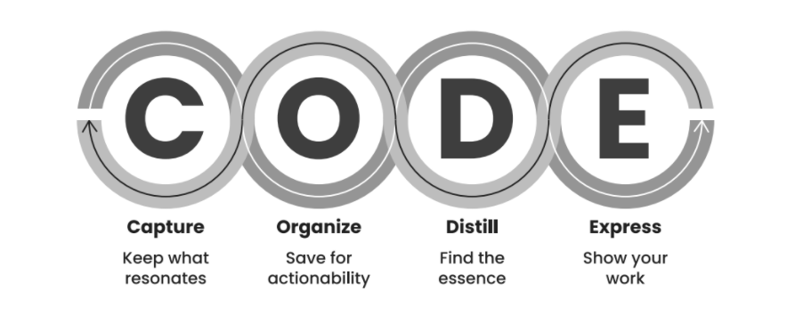

# Building a second brain

A while ago I stumbled upon a youtube video by Ali Adbaal [^1] discussing how to organise your life by making use of a second brain. His video is basically a book summary of the book Building a Second Brain by Tiago Forte. 

After watching Ali's video I got intrigued and bought the book to read it myself.
To me this idea was an eye opener! If you want to know a little bit more about what exactly a second brain is, how I am implementing it in my life and what my experience with it is so far, I encourage you to read on.

Happy reading! 

## What is a second brain

So building a second brain... That sounds very science-fiction doesn't it ? Like having an external brain in a pickle jar on your desk, connected to your head with some cables. You might be wondering if that means you'll need to undergo surgery to add USB-ports to your skull for this to work. Don't worry, you don't. A second brain is noting like that. Luckely! 

So what is a second brain. A second brain is an organisatory structure that allows you to offload information into. Information that you otherwise would have to memorise in your (first) brain. How often do you come across some important or interesting information only to think "oh, I'll just remember that" only to realise a couple of days/weeks/months later that when you actually want or need to remember that information that it seems to be completely erased from your mind ?

This is where a second brain comes in to play. By using a second brain you can quicly store that piece of information somewhere digitally and just look for it later when you want to use it. At this point you might be wondering "Does this needs to be a digital structure? Can't you just use a notebook?" Well, ofcourse you can. 
But by keeping your information stored in a digital medium you can leverage technology to make your second brain even more powerfull. Digital note taking apps nowadays all have a pretty solid search functionality. This makes finding that specific piece of information you are looking for so much easier! A second brain is only useful if you can actually find the information that you are looking for, right? 

If you are like me and are getting bad at storing things in your long-term memory but you are great at knowing where you found stuff this might sound pretty interesting.
What information then do we store in that second brain of ours? Obviously it would be an impossible task to store all the information that we process on a daylie basis into a digital note app. No fear! We don't have to. Not all information that we process is useful information. To make the distinction of what and how to save information in your second brain the author, Tiago Forte, has developed the CODE framework.

CODE stands for capture-organise-distill-express.

 
### CAPTURE
### ORGANISE
### DISTILL
### EXPRESS

* Why ?

    **4 essential capabilities of a second brain:**
    1. Making our ideas concrete
    2. Revealing new associations between ideas
    3. Incubating our ideas over time 
    4. Sharpening our unique perspective
* code
    zie notes voor content
* para
    zie notes voor content
* note apps 
* advantages
## How do I implement this in my life
* notion -> dashboard van Thomas Frank
* readwise.io voor exporting van highlights + read-later app

## My experience with a second brain so far
* easy to sort information containing to different projects/areas
* tasks are momentarily still all over the place -> must improve

[^1]: Ali abdaal: How to Organise your Life - Building a Second Brain https://www.youtube.com/watch?v=K-ssUVyfn5g&ab_channel=AliAbdaal
